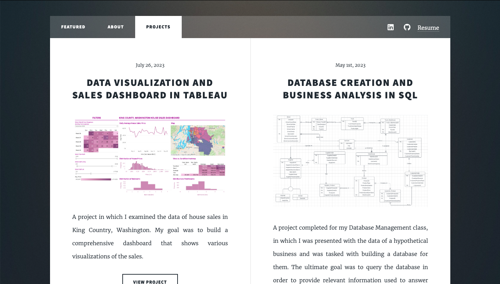

# Project: Portfolio Website creation and deployment through HTML5 and Github
Bonus project focused on the creation of my portfolio website using HTML5 and it's deployment through Github.

## Project Overview
This is the project that is perhaps the most important in my journey as a data analyst: the creation of a website designed to showcase my projects and information. This portfolio website serves as an efficient method of communicating my skills, qualifications, and experiences to potential employers.

* Installed a website framework from [HTML5Up](html5up.net)
* Coded the framework of the website using the application Visual Studio Code.
  * Linked all individual project repositories from Github into a portfolio
    
  * Connected all contact information including my LinkedIn, Github, and Resume.
* Uploaded files into this repository in order to deploy the website through Github Pages.
